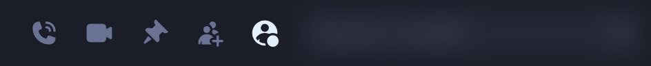
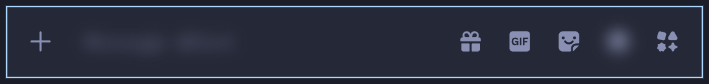
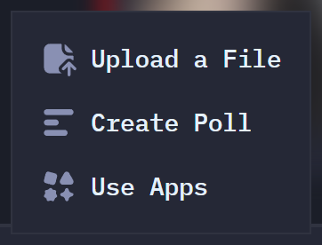
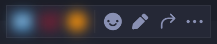
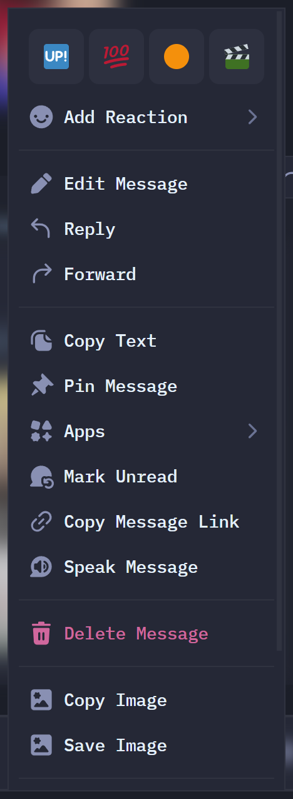
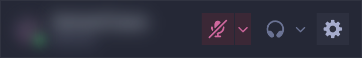

# Discord surface audit

Walked live in Vesktop with our Vencord build on 2026-10-06 (Discord stable 629779). Marked by
Claude on 2026-10-06 from `DESIGN.md` (HumanLayer material, Maeda's discipline, Slack's
structure), at Aditya's request. Change any mark and the plugins follow.

**Marks:**
- **K** keep
- **H** hidden by default, with a toggle to bring it back
- **C** changed

**Status** after each line:
- **done**: shipped in this build
- **later**: needs more than CSS, or wasn't checkable live
- **yours**: an account setting, so flipping it also changes your main Discord

Toggles live in Vencord › Plugins: **Declutter** (what's shown) and **QuietLayout** (structure).
Screenshots are cropped and blurred (`personal/tools/redact.css`) because this repo is public.

## 1. Window and title bar (Vesktop)

- [K] Back / forward arrows
- [K] Window title: current server or DM name
- [K] Inbox button, see §10
- [H] Help button (support.discord.com): done
- [K] Tray icon, close-to-tray
- [H] Splash screen while loading: done (Vesktop setting, in this profile)
- [K] Unread badge on the taskbar icon
- [K] Start on login: left off
- [K] Rich Presence (arRPC): off in this profile while your Discord runs
- [C] App name and icon still say "Vesktop": later (milestone 7, name and icon in Questions)

## 2. Server rail

- [K] Home / DMs button and its count
- [K] Unread DMs as avatars under Home
- [C] Server icons: square, no squircle: done (QuietLayout › square rail)
- [K] Server folders
- [C] Unread / selected indicator: a thin square edge, accent when selected: done
- [K] Speaker / live / event icons on server icons
- [K] "NEW" mentions pill: pink, square
- [H] Add a Server: done
- [H] Discover: done
- [H] Download Apps: done
- [C] Server hover card without the boost-tier footer: done

## 3. Server: channel list

- [H] Server banner image and its glass/glow header: done
- Server header menu:
  - [H] Server Boost: done
  - [H] Server Tag: done
  - [K] Invite to Server
  - [H] App Directory: done
  - [H] Linked Roles: done
  - [K] Show All Channels, Hide Muted Channels, Notification Settings, Privacy Settings, Edit Per-server Profile, Leave, Copy ID
- [H] Invite button next to the server name and on the selected channel: done
- [H] Boost goal bar and "Server Boosts" row: done
- [K] Events row (toggle exists, off)
- [H] "Channels & Roles" / server guide rows: done
- [H] "Suggested" channels block: later (needs a server that shows it, checked without opening anything unread)
- [H] Channels locked behind server subscriptions: later
- [K] "Not on your channel list" banner
- [K] "New unreads" bar
- [K] Voice channel members
- [C] Unread channels are bold only (no side pips), muted channels dimmed: done (QuietLayout › quiet sidebar)
- [K] Channel right-click menu

## 4. Home: DM list and Friends

- [K] "Find or start a conversation"
- [K] Friends row and pending count
- [K] Message Requests row
- [H] Nitro, Shop, Quests rows: done
- [K] "+" to start a DM or group
- [C] DM rows on one line, no activity or status line: done (QuietLayout › one line per row)
- [H] Server tag chips next to names: done
- [K] Friends tabs: Online, All, Pending, Add Friend
- [H] Active Now: done
- [H] "Looking for accounts you've blocked or ignored?" notice: done

## 5. Channel header

- [K] Threads, Notification Settings, Pinned Messages, Member List toggle, Search
- [K] Channel topic
- [K] DM voice and video call
- [H] Add to DM: done
- [K] DM profile panel (it's already a toggle). Its banner and theme colours are neutral: done

## 6. Composer

- [K] "+" › Upload a File
- [H] "+" › Create Poll: done
- [H] "+" › Use Apps: done
- [H] Gift button: done
- [K] GIF picker
- [H] Sticker button: done
- [K] Emoji picker
- [H] Apps launcher button: done
- [K] Slowmode and permission notices
- [C] Typing indicator: static, no animated dots: done (QuietLayout › nothing moves)

## 7. Messages

- [C] Avatars: 32px square with a tighter gutter: done (QuietLayout › smaller avatars)
- [H] Display-name fonts and effects: done
- [C] Names in one colour; no role colours, role icons or "new member" sprouts: done (QuietLayout › one colour for names)
- [H] Server tags next to names: done
- [K] APP / BOT tags
- [K] Reply previews, embeds, link previews, attachments, stickers, reactions
- [H] Super-reaction glow and burst animations: done (the reaction and count stay)
- [K] Forwarded messages, polls, voice messages
- [C] System messages: joins, boosts and purchase notices hidden; pins and threads stay: done
- [H] Avatar decorations: done
- [K] Date dividers, "NEW" divider, mention highlight

**Hover bar** (now: react, reply/edit, more)

- [H] Quick reactions: done
- [K] Add Reaction
- [K] Reply / Edit
- [H] Forward: done
- [K] More

**Right-click menu**

- [H] Quick reaction row: done
- [K] Add Reaction, Reply, Edit, Copy Text, Pin, Mark Unread, Copy Message Link
- [H] Forward: done
- [H] Apps ›: done
- [H] Speak Message: done
- [K] Report / Delete
- [K] Image actions
- [K] Copy Message ID

## 8. Member list and profiles

- [K] Member list (starts hidden; Slack has none)
- [K] Role groups
- [H] Nameplates: done
- [C] Member rows on one line, no activity line: done
- [H] Profile banners and Nitro theme colours: done (popout, DM panel, full profile)
- [H] Profile effects: done
- [H] Badges: done
- [H] React / reply to status: done
- [K] Mutual friends and servers, member since, roles, note, "Message @" box
- [H] "Originally known as": done
- [K] Add Friend, More, View Full Profile
- [K] User right-click menu
- [H] User menu › Apps, Invite to Server: done
- [H] "Shop this look" coachmark on popouts: later (one-off, dismissed; no stable hook yet)

## 9. User panel

- [K] Avatar / status menu, mute, deafen, device carets, settings
- [K] In-call controls (camera, screen share, disconnect)
- [H] In-call activities and soundboard: later (not checked live; I didn't join voice)

## 10. Inbox

- [K] Unreads and Mentions tabs, friend request shortcut, Mark All as Read
- [C] One Slack-style unread view in the sidebar instead of a popout: later (milestone 5's big piece)

## 11. Notifications

- [K] Desktop notifications on
- [H] "Notify me when": streaming in small servers, friendship anniversaries, friends come online, upcoming events, friends update their profile: yours, Settings › Notifications
- [K] "Someone reacts to my messages": your call
- [K] Sounds, unread badge on the app icon
- [H] Emails: tips, recommendations, announcements, social: yours; "Unsubscribe from all marketing emails" does most of it
- [K] Per-server and per-channel notification settings
- [C] Your own rules (by person, keyword, time of day, digest): later (milestone 6)

## 12. Paid features, promos and games

- [H] Nitro / Shop / Quests rows, gift button, billing settings, boosts, server tags, apps and activities, Active Now, super-reaction effects, profile cosmetics, quest icons: all done
- [H] Nitro-locked emoji and stickers shown in the pickers: later
- [H] Server subscription upsells (locked channels with prices): later
- No to FakeNitro. Using paid features without paying is the plugin most likely to get an account
  flagged, and the plan's first rule is account safety. Revisit if you miss it.

## 13. Settings

- [K] Account, Data & Privacy, Messaging Permissions, Notifications
- [H] Family Center: done
- [K] Vencord, Plugins, Themes, Cloud, Backup & Restore, Vesktop
- [H] Patch Helper (a Vencord dev tool): done
- [H] Nitro, Server Boost, Subscriptions, Gift Inventory, Billing: done (the whole Billing section)
- [K] Voice & Video, Appearance, Accessibility, System, Language & Time, Activity Privacy, Connected Apps, Developer
- [H] Footer (build number, policy links): later

## Questions answered

1. Anything missing? Still yours to add.
2. Server icons: square (QuietLayout toggle to go back).
3. FakeNitro: no.
4. Name and icon: proposed in the hand-off message, not applied.
